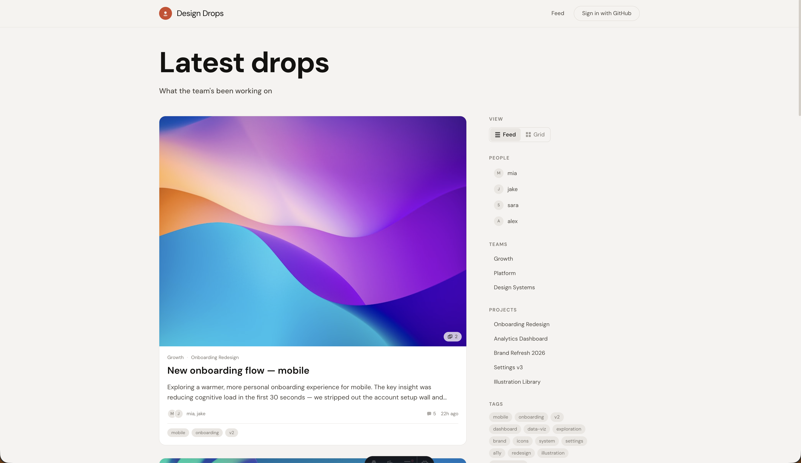

# Design Drops

An internal design showcase and collaboration tool. Designers post work to a shared feed backed by GitHub Discussions — no dedicated backend needed.



## Stack

| Layer | Technology |
|---|---|
| Framework | [Astro](https://astro.build) (static output) |
| Islands | [Svelte 5](https://svelte.dev) |
| UI | [Bits UI](https://bits-ui.com) + [Tailwind CSS v4](https://tailwindcss.com) |
| Language | TypeScript (strict) |
| Data | GitHub Discussions |
| Auth | GitHub PAT (user-provided Personal Access Token) |
| Deploy | GitHub Pages |

## Getting started

```bash
node -v  # requires Node 22+
npm install
npm run dev
```

Open [http://localhost:4321/design-drops](http://localhost:4321/design-drops)

### Configuration

Repo and site settings live in [`drops.config.json`](drops.config.json). No environment variables are required — auth is handled via PAT pasted by each user in the browser.

## Commands

| Command | Description |
|---|---|
| `npm run dev` | Start dev server |
| `npm run build` | Production build to `dist/` |
| `npm run preview` | Preview production build locally |

## Architecture

Users authenticate by pasting a GitHub Personal Access Token (with `repo` + `read:user` scopes) into the app. The token is stored in `localStorage` and used for all reads via GitHub's GraphQL API. Writes (create, edit, delete) are dispatched through the same token.

Posts are stored as GitHub Discussions with structured metadata in `<!-- dd-meta {...} -->` HTML comments. Every write is reflected optimistically in `localStorage` while the roundtrip completes in the background.

See [`plan.md`](plan.md) for the full design document and [`AGENTS.md`](AGENTS.md) for contributor/AI instructions.

## Project layout

```
src/
  components/     # Svelte island components (Feed, PostCard, PostComposer, etc.)
  layouts/        # Astro layouts
  pages/          # Astro pages (index, post detail, 404)
  styles/         # Global CSS (Tailwind)
  lib/
    api/          # GraphQL client, queries, workflow dispatcher, image handling
    auth/         # PAT-based authentication
    stores/       # Svelte stores (auth, local optimistic state)
    types/        # TypeScript interfaces (PostMetadata, Asset, etc.)
    config.ts     # Runtime config from drops.config.json
    metadata.ts   # dd-meta parser/serializer
    polling.ts    # localID confirmation polling
    reconcile.ts  # Merge localStorage + API feed data
```

## Versioning

This project uses [Changesets](https://github.com/changesets/changesets) for versioning.

```bash
npx changeset        # create a changeset
npx changeset version  # bump version
```

## License

ISC
